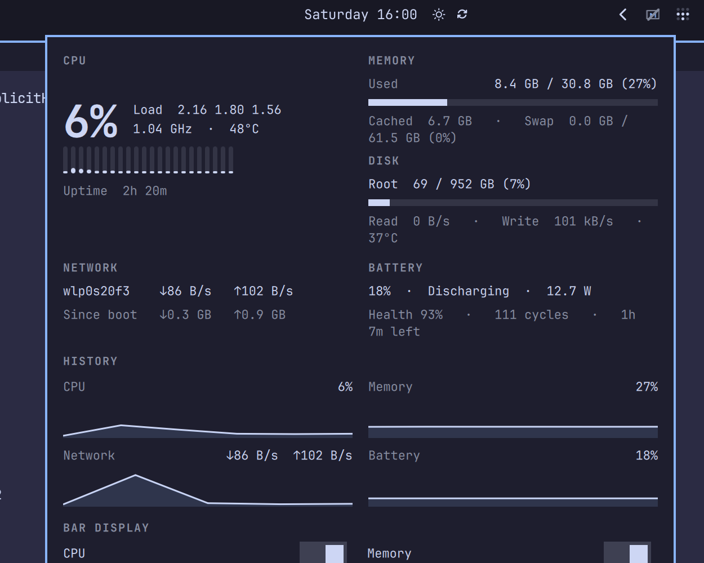

# System Pulse — an iStat-style system monitor for Omarchy

An iStat Menus-style system monitor for the [Omarchy](https://omarchy.org/) bar. Live CPU, memory, disk, network, battery, GPU, and temperature readings in the status bar, with a detail popup — sampled from `/proc` and `/sys`.




## Features

- **Bar label** — compact, iStat-style: `CPU 6%   MEM 30%   ↓22k ↑1k   BAT 90%` (each segment toggleable; compact mode drops the prefixes). Click a segment to open that section in the popup.
- **Detail popup** (click the bar label):
  - **CPU** — usage hero, load averages, frequency, package temperature, per-core mini-bars, uptime
  - **Processes** — top 5 by CPU while the popup is open
  - **History** — live sparklines for CPU, memory, network and battery, labeled with the real time window
  - **Memory** — used/total, cached, swap
  - **Disk** — each real filesystem (not bind mounts of the same device), live read/write speeds, NVMe temperature
  - **Network** — default interface (IPv4 or IPv6), ↓/↑ speeds, totals since boot, local IP
  - **Battery** — charge, state, power draw, health vs design capacity, cycle count, time remaining (`ENERGY_*` and `CHARGE_*` packs)
  - **GPU** — busy percent when the kernel exposes it
  - **Bar display** — toggle bar segments, compact mode, optional ping check, and alert notifications right in the popup
- **Alerts** — only the failing segment turns urgent: low battery, hot CPU, high memory, full disk — optional ping-based network alert; optional desktop notifications fire once per alert and open the panel on click
- **Right-click** — opens `btop` in a floating terminal for the deep dive
- **Vertical bar aware**, theme-aware (follows your Omarchy theme colors)
- Hover tooltip with an exact summary

Everything updates every 2 seconds via kernel interfaces (`/proc/stat`, `/proc/meminfo`, `/proc/diskstats`, `/proc/net/dev`, `/sys/class/power_supply`, `/sys/class/hwmon`). No polling daemons. Connectivity ping is off unless you enable it.

## Requirements

- Omarchy (with the Omarchy shell / Quickshell bar)
- `btop` (optional — only for the right-click detail view)

Battery, temperature, GPU, and network sections appear automatically when the hardware exposes them.

## Install

```bash
omarchy plugin add https://github.com/Coding-Sparrow/omarchy-systempulse.git --enable
```

## Remove

```bash
omarchy plugin disable coding-sparrow.systempulse   # hide it from the bar
omarchy plugin remove coding-sparrow.systempulse    # delete it entirely
```

## Settings

Easiest first: **click the bar widget** and use the toggles in the popup's "Bar display" section — they persist automatically.

You can also use the Omarchy CLI (no JSON editing needed):

```bash
omarchy bar set coding-sparrow.systempulse showNet false
omarchy bar set coding-sparrow.systempulse compactBar true
omarchy bar set coding-sparrow.systempulse alertTemp 80
omarchy bar set coding-sparrow.systempulse notifications true
omarchy bar set coding-sparrow.systempulse interval 1000
omarchy bar set coding-sparrow.systempulse checkConnectivity true
```

Full list of keys (all optional — defaults shown):

| Key | Default | Purpose |
|-----|---------|---------|
| `showCpu` | `true` | CPU segment in the bar label and history |
| `showMem` | `true` | Memory segment and history |
| `showNet` | `true` | Network segment and history |
| `showBattery` | `true` | Battery segment and history (auto-hides without a battery) |
| `showGpu` | `true` | GPU segment when `gpu_busy_percent` exists |
| `compactBar` | `false` | Drop CPU/MEM/BAT prefixes |
| `checkConnectivity` | `false` | Periodic ping probe for packet-loss alerts |
| `interval` | `2000` | Sample interval in milliseconds (500–10000) |
| `alertBattery` | `20` | Turn the label urgent when the battery (discharging) falls below this % |
| `alertTemp` | `85` | Turn the label urgent when the CPU package exceeds this °C |
| `alertDisk` | `90` | Turn the label urgent when the root disk exceeds this % |
| `alertMem` | `95` | Turn the label urgent when used memory exceeds this % |
| `notifications` | `false` | Fire a desktop notification once as each alert triggers |
| `pingInterval` | `10000` | Connectivity probe interval in milliseconds (only if ping check is on) |
| `netAlertFailures` | `3` | Consecutive failed probes before the network segment turns red |
| `detailCommand` | `btop` floating terminal | Command run on right-click |

Every key can also be set in the widget's entry in `~/.config/omarchy/shell.json`:

```json
{ "id": "coding-sparrow.systempulse", "showNet": false, "compactBar": true, "notifications": true }
```

## How it works

The widget is a standard Omarchy shell plugin (Quickshell/QML):

- `SysMon.qml` — bar widget, FileViews, timers.
- `Model.js` — parsing and formatting (`/proc`, `/sys`, `df`, `ps`).
- `Panel.qml` — detail popup built on the shell's own `Panel`/`KeyboardPanel` infrastructure, bound live to the sampler.
- Device discovery (CPU/NVMe temperature paths, battery path, GPU busy path) happens once at startup via `/sys/class/hwmon`, `/sys/class/power_supply`, and `/sys/class/drm`.

No config files are read or written outside the plugin's own settings in `shell.json`.

## Tests

```bash
node test/model-test.js
```

## License

[MIT](LICENSE)
